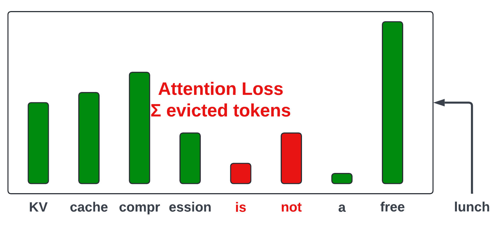

# Cold Compress 1.0

**Cold Compress** is a **hackable**, **lightweight** toolkit for creating and comparing **KV cache compression** methods.

**Cold Compress** is built on top of [GPT-Fast](https://github.com/pytorch-labs/gpt-fast/), a simple, PyTorch-native generation codebase. It takes advantage of [torch.compile](https://pytorch.org/tutorials/intermediate/torch_compile_tutorial.html), which allows for GPU efficient code to be written in PyTorch without customized kernels.


Please see our [blog post](www.todo.com) for a *very* deep dive into the KV Cache, cache compression, and the *many* SOTA strategies supported by **Cold Compress**.

Our initial release (**Cold Compress 1.0**) supports a wide set of popular approaches to KV cache compression, including:
- Attention-based evictions, e.g., `Heavy Hitters`
- Sliding window attention, e.g., `Recent Tokens`
- Preservation of attention sinks, e.g., `Global Tokens`
- Layerwise customization, e.g., `Pyramid` shaped compression, alternating `Local-Global` attention
- Hybridization across attention heads (`FastGen`)

**Cold Compress** implements existing methods, for which we make sure to give all the credit. Yet, to demystify these approaches, we use generic names to represent classes of existing methods (e.g., `Heavy Hitter` to cover {`H20`, `Scissorhands`, `PyramidKV`}). (todo add cites)

The intended effect is that **Cold Compress** is easy to follow, customizable from the command line, and low effort to extend! The code should be able to be configured or slightly tweaked to exactly match existing methods.

## Installation
[Download PyTorch nightly](https://pytorch.org/get-started/locally/)
```bash
pip install packaging ninja
MAX_JOBS=8 pip install flash-attn --no-build-isolation # Set MAX_JOBS to a lower value if you get OOM errors.
pip install -r requirements.txt
```

After logging in with `huggingface-cli login`, run

```bash
bash scripts/prepare_llama2.sh
bash scripts/prepare_llama3.sh
bash scripts/prepare_qwen2.sh
```

This will download model and tokenizer files from HuggingFace for [`Meta-Llama-3-8B-Instruct`](https://huggingface.co/meta-llama/Meta-Llama-3-8B-Instruct), [`meta-llama/Llama-2-7b-chat-hf`](https://huggingface.co/meta-llama/Llama-2-7b-chat-hf) and [`Qwen/Qwen2-7B-Instruct`](https://huggingface.co/Qwen/Qwen2-7B-Instruct) and save them into a usable format inside `./checkpoints`.

Please raise an [issue](https://github.com/AnswerDotAI/context-compression/issues) if you would like to see more models supported.

## Quick Start

```
python generate.py --compile --cache_strategy full --prompt "What is a cold compress?" --checkpoint_path ./checkpoints/meta-llama/Meta-Llama-3-8B-Instruct/model.pth
```

This will generate a response from a compiled Llama-3 with no cache compression (`--cache_strategy full`).
If you want to run on longer prompts, you can add it as a *.txt* file to `./prompts` and run with `python generate.py --prompt my_custom_prompt.txt`. We've also pre-populated `prompts` with a few diverse prompts!

### Generating with Compression


*Capturing the flow of information between a model (attention) and the KV Cache.*

To use a compressed KV cache, specify a `cache_strategy != "full"`, e.g., `"recent_global"`, `"heavy_hitter"`, `"hybrid"`, `"random"`, `"l2"`.

Check out all the available cache strategies in `def get_cache_constructor` from `cache.py`.

Each cache strategy has a unique set of hyper-parameters controllable from the command line.

For instance, to customize sliding-window attention with a global attention sink (`recent_global`), check out its hyper-parameters by looking at the `relevant_kwargs` attribute of the `KVCacheRecentGlobal` class.

```
class KVCacheRecentGlobal(KVCache):
    relevant_kwargs = [
        "max_cache_length",
        "max_seq_length",
        "global_tokens",
        "prompt_compression_strategy",
    ]
```

We can run

```
python generate.py --compile --prompt reverse_list.txt --checkpoint_path ./checkpoints/meta-llama/Meta-Llama-3-8B-Instruct/model.pth --cache_strategy recent_global --max_cache_length 0.5 --global_tokens 4 --prompt_compression_strategy recent_global
```

`max_cache_length`: size of the KV cache represented as a fraction of total sequence length (`|prompt| + max_new_tokens`). You can also specify `max_cache_length` as an integer `> 1` to set the exact size.

`global_tokens`: the number of lead tokens to always keep in the KV cache. Lead tokens are [attention sinks](https://arxiv.org/abs/2309.17453) and should always be preserved.

`prompt_compression_strategy`: the strategy for filtering tokens during prefill **iff** `|prompt| > max_cache_length`. Choose a strategy from `prompt_compression.py`. Here, we chose a strategy `recent_window` to match our KV Cache strategy.


## Using a Cache Config

It can be a pain to pass a long list of hyper-parameters via the command line.

To avoid this, you can create a `Cache Config` *.yaml* file instead.

We've pre-populated it with some configurations, including the `recent_global` strategy discussed above.

```
cache_strategy: ["recent_global"]
prompt_compression_strategy: ["recent_global"]
global_tokens: 4
```

## Benchmarking Performance

Use `generate.py` to vibe test methods on individual prompts.

For benchmarking, use `eval.py` which supports evals on a growing list of long-context tasks: domain-specific ([Dolomites](https://dolomites-benchmark.github.io/index.html)), synthetic ([RULER](https://arxiv.org/abs/2404.06654)), QA ([MuSiQue](https://arxiv.org/abs/2108.00573v3), [TriviaQA](https://nlp.cs.washington.edu/triviaqa/), [QuALITY](https://arxiv.org/abs/2112.08608)), coding ([RepoBench](https://arxiv.org/abs/2306.03091)), summarization ([QMSum](https://arxiv.org/abs/2104.05938), [SQuALITY](https://arxiv.org/abs/2205.11465)), and long generation (PG-19 books).

```
python eval.py –cache_config hybrid –tasks dolomites rulerniah
```

Will apply the cache strategy specified in `./cache_configs/hybrid.yaml` and test on Dolomites and RULER needle-in-a-haystack.

`eval.py` creates a directory based on the supplied cache arguments to dump the raw predictions and metrics for memory usage and task-specific performance.

### Metrics

*See `metric.py` for a full list of supported metrics*

For multiple-choice QA, we measure accuracy by comparing the log likelihoods of generating each answer option, as in [lm-eval-harness](https://github.com/EleutherAI/lm-evaluation-harness).

For free-text generation, we record standard reference-based metrics, [ROUGE](https://huggingface.co/spaces/evaluate-metric/rouge) and [BERTScore](https://huggingface.co/spaces/evaluate-metric/bertscore). Yet, given well documented limitations of these metrics, we focus on a new metric `LLM-Rouge`. `LLM-Rouge` prompts an LLM ([Claude Haiku](https://www.anthropic.com/news/claude-3-haiku)) to judge the similarity of a model generated text with one or more ground-truths on a 1-5 LIKERT scale:

```
TEMPLATE = """You are shown ground-truth answer(s) and asked to judge the quality of an LLM-generated answer.
Assign it a score from 1-5 where 1 is the worst and 5 is the best based on how similar it is to the ground-truth(s).
Do NOT explain your choice. Simply return a number from 1-5.

====GROUND TRUTHS====
{labels}

====ANSWER====
{prediction}"""

PREFILL = "The score (1-5) is:"
```

We elicit Claude Haiku responses using Answer.AI's Anthropic wrapper [Claudette](https://github.com/AnswerDotAI/claudette).

### Parallelizing Eval

As of now, GPT-Fast and, by extension, **Cold Compress**, only supports single batch, single GPU inference. (We are working on adding batched multi-GPU inference.)

To take advantage of multiple GPUs, we’ve written a script to parallelize eval jobs. 

We've created two interfaces for parallelization:

The first is to provide a set of cache_configs, cache_sizes, and tasks which you’d like to evaluate, as shown below:

```
python parallelize_evals.py \
    --config_names random l2 heavy_hitter window \
    --tasks truthfulqa rulerqa rulerniah rulervt rulercwe scrollsquality musique squality dolomites qmsum repobench \
    --cache_sizes 0.75 0.5 0.25 0.1 0.05 \
    --num_samples 500 \
    --add_full \
    --num_gpus 8 \
    --checkpoint_path checkpoints/meta-llama/Meta-Llama-3-8B-Instruct/model.pth
```

This command will take the cartesian product of the `config_names`, `tasks`, and `cache_sizes`, and create the appropriate evaluation jobs and queue them across 8 GPU workers.

Alternatively, we can also pass in a text file consisting of individual evaluation commands, one per line, that need to be parallelized across the GPU workers:

```
python parallelize_evals.py \
    --command_file experiments/eval_jobs.txt 
    --num_gpus 8
```
## Advanced Usage

### Multi-Strategy

A recent [blogpost from Character.ai](https://research.character.ai/optimizing-inference/) revealed the company’s strategies for bringing down LLM inference costs, which collectively, enable them to serve a whopping 20,000 queries per second! A focal point is reducing the size of the KV Cache.

In addition to using multi-query attention (MQA), they introduce two modifications:
1. Alternating **Local-Global** layers
2. **Cross-Layer Attention**: this is basically MQA across layers. Coming soon to **Cold Compress**!


**Local-Global** attention is intriguing because it enables compression without losing the full history, which is preserved at certain layers.

In **Cold Compress**, **Local-Global** is just a mix of cache strategies (`RecentGlobal` and `Full`) across layers:

```
python eval.py –compile –cache_config local_global.yaml
```

Which sets the following args:

```
cache_strategy: ["recent_global", "full"]
cache_strategy_pattern: "repeat" # or tile
max_cache_length: [0.25, 1.0]
cache_length_pattern: "repeat" # or tile
prompt_compression_strategy: ["recent_global", None]
global_tokens: 4
```

We set a dynamic strategy by passing a list of strategies to `cache_strategy` and then control the pattern by setting `cache_strategy_pattern` to “repeat” which alternates the two. “tile” sets the first `N // 2` layers to full and the final `N // 2` layers to full.

You can pass in a `cache_strategy` of any length, provided it is a factor of the number of layers in the model (`32` for `Llama-3-8B`).

You can run a pre-configured set of local-global experiments with:

```
bash experiments/local_global.yaml
```

### Dynamic Compression Ratios

There is no consensus regarding the optimal allocation of a KV cache budget across layers.

While [PyramidKV](https://arxiv.org/abs/2406.02069) proposes increasing compression at higher layers, [ScissorHands](https://arxiv.org/abs/2305.17118) advocates for the opposite. ScissorHands finds that `Heavy Hitters` are more variable at higher layers, so larger caches are needed to reduce cache misses.

Most other work proposes a uniform cache size.

We introduce `--cache_length_pattern` to enable experimentation around this important hyper-parameter.

To use a pyramid cache pattern, you can set `--cache_length_pattern pyramid`.

Alternatively, `--cache_length_pattern pyramid` funnel will decrease

The value passed for `--max_cache_length` represents the average cache size for pyramids and funnels.

The default for cache length pattern is tile, which tiles the cache size pattern provided to match the model depth.

```
--max_cache_length 0.1 0.5 –cache_length_pattern tile
```
Assigns a cache size of `0.1` to the first `L // 2` layers and `0.5` to the second half.  To alternate, set:

```
--max_cache_length 0.1 0.5 –cache_length_pattern repeat
```

You can kick off a pre-defined set of experiments for length customization by running

```
bash experiments/dynamic_length.sh
```

### Recording Attention Loss

To better understand why one method may work better than another, it is important to understand the intrinsic cost of compression.

Specifically, it’s nice to be able to understand the deviation from the full attention caused by token dropping. As defined in [L2-Norm](https://arxiv.org/abs/2406.11430) and [FastGen](https://arxiv.org/abs/2310.01801), we compute the attention loss as the sum of the attention probabilities for the evicted tokens.



To calculate the **Attention Loss**, we need to keep all tokens in the KVCache, e.g., set cache strategy to `full`, while simulating evictions for a compressed cache.

To do this, we create a new class `KVCacheAnalysis` which is invoked when the cache strategy is prepended with the string `debug`:

```
python eval.py --cache_strategy debug_scissor
```

A handful of debugging experiments can be kicked off by running:

```
bash experiments/attention_loss.sh
```

# Getting Involved

We'd love for you to get involved and collectively aim to improve `Cold Compress` for future releases.

1. Participate in discussions of KV Cache Compression on our [discord channel](www.todo.com).
2. Raise an [issue](https://github.com/AnswerDotAI/context-compression/issues) for something you'd like to see fixed, improved, or built.
3. Even better, issue a [Pull Request](https://github.com/AnswerDotAI/context-compression/pulls) for a change.
4. Submit a new KV Cache compression method via a [PR](https://github.com/AnswerDotAI/context-compression/pulls) which we will run and add to our [Leaderboard](www.todo.com).

## Getting Involved with Modeling

We are actively exploring supporting the following in `Cold Compress`:
1. [GIST tokens](https://arxiv.org/abs/2304.08467).
2. CPU offloading of ``evicted'' tokens, e.g., [InfLLM](https://arxiv.org/abs/2402.04617).
3. [Cross Layer Attention](https://arxiv.org/abs/2405.12981).
4. Bayesian optimization to find optimal hybrid strategy.
5. KV-Cache Lite Architectures, e.g., [YOCO](https://arxiv.org/abs/2405.05254), [GoldFinch](https://arxiv.org/abs/2407.12077), [Infini-attention](https://arxiv.org/abs/2404.07143), [LoMA](https://arxiv.org/abs/2401.09486).

## Getting Involved with Eval

We are actively exploring the following enhancements to our evaluation benchmarks:
1. New metrics and datasets to capture areas of regression that existing benchmarks might otherwise overlook.
2. Synthetic tasks with abrupt topic shifts to pressure test token dropping.
3. A better understanding of the impact of attention loss on downstream loss.