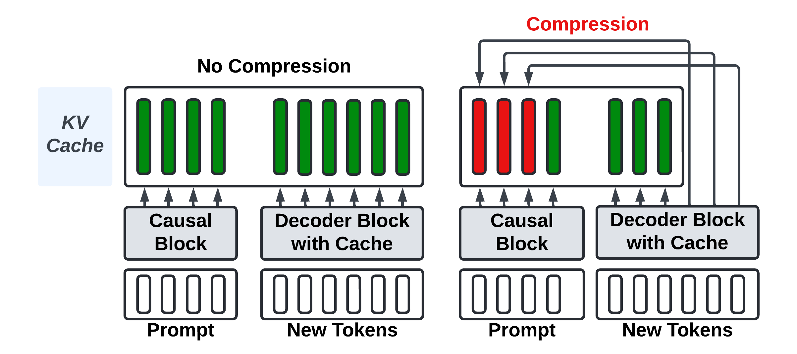
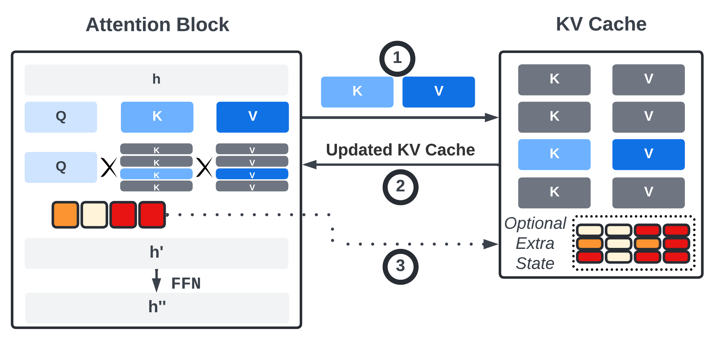
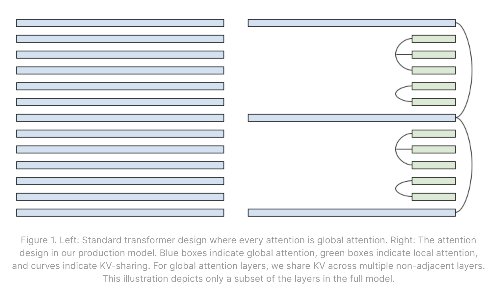
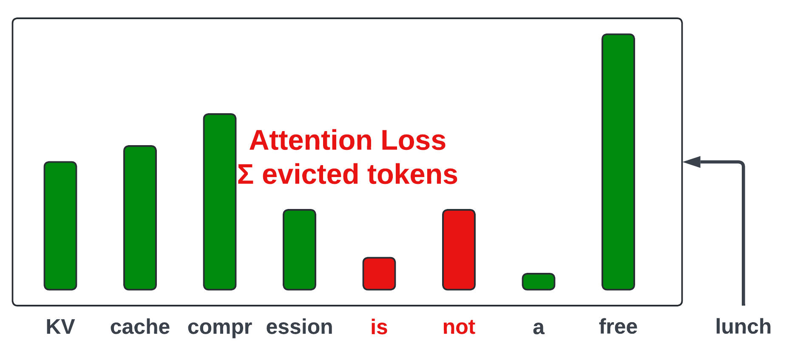
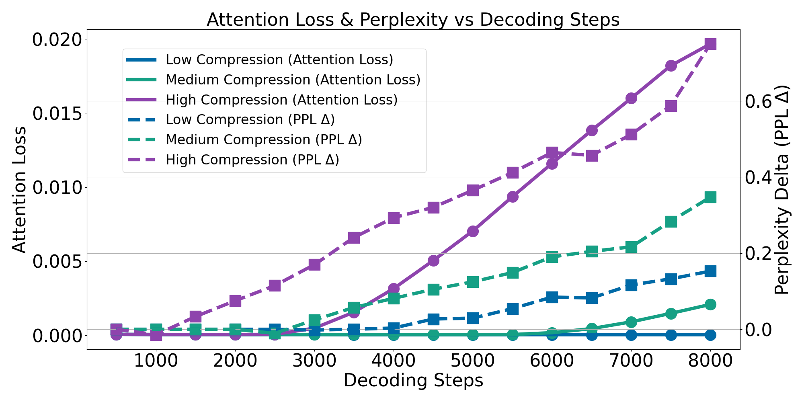

# Cold Compress 1.0

**Cold Compress** is a **hackable**, **lightweight**, **open source** toolkit for creating, extending, and comparing **KV cache compression** methods.

Created at [Answer.AI](https://www.answer.ai/), **Cold Compress** is built on top of [GPT-Fast](https://github.com/pytorch-labs/gpt-fast/), a simple, PyTorch-native generation codebase. It takes advantage of [torch.compile](https://pytorch.org/tutorials/intermediate/torch_compile_tutorial.html), which allows for GPU efficient code to be written in PyTorch without customized kernels.



Please see our [blog post](https://www.answer.ai/posts/2024-08-01-cold-compress.html) for a *very* deep dive into the KV Cache, cache compression, and the many SOTA strategies supported by **Cold Compress**.

Our initial release (**Cold Compress 1.0**) supports a wide set of popular approaches to KV cache compression, including:
- Attention-based evictions, e.g., `Heavy Hitters`
- Sliding window attention, e.g., `Recent Tokens`
- Preservation of attention sinks, e.g., `Global Tokens`
- Layerwise customization, e.g., `Pyramid` shaped compression, alternating `Local-Global` attention
- Hybridization across attention heads, e.g., `FastGen`

**Cold Compress** implements existing methods, for which we make sure to give all the credit. Yet, to demystify these approaches, we use generic names to represent classes of existing methods (e.g., `Heavy Hitter` to cover {[`H20`](https://arxiv.org/abs/2306.14048), [`Scissorhands`](https://arxiv.org/abs/2305.17118), [`PyramidKV`](https://arxiv.org/abs/2406.02069)}).

The intended effect is that **Cold Compress** is easy to follow, customizable from the command line, and low effort to extend! The code should be able to be configured or slightly tweaked to exactly match existing methods.

## Installation
```bash
pip install -r requirements.txt --extra-index-url https://download.pytorch.org/whl/nightly/
```

After logging in with `huggingface-cli login`, run any of the following:

```bash
bash scripts/prepare_llama3.sh
bash scripts/prepare_llama2.sh
bash scripts/prepare_qwen2.sh
```

This will download model and tokenizer files from HuggingFace for any one of [`Meta-Llama-3-8B-Instruct`](https://huggingface.co/meta-llama/Meta-Llama-3-8B-Instruct), [`meta-llama/Llama-2-7b-chat-hf`](https://huggingface.co/meta-llama/Llama-2-7b-chat-hf) or [`Qwen/Qwen2-7B-Instruct`](https://huggingface.co/Qwen/Qwen2-7B-Instruct) respectively and save them into a usable format inside `./checkpoints`.

We are working on [`Meta-Llama-3.1-8B-Instruct`](https://huggingface.co/meta-llama/Meta-Llama-3.1-8B-Instruct), which is available with:

```bash
bash scripts/prepare_llama31.sh
```

Yet is currently untested.

Please raise an [issue](https://github.com/AnswerDotAI/context-compression/issues) or join our [public Discord server](https://discord.gg/NvERJKrEdA) if you would like to see more models supported or collaborate on new releases.

## Quick Start

```
python generate.py --cache_strategy full --prompt "What is a cold compress?" --checkpoint_path ./checkpoints/meta-llama/Meta-Llama-3-8B-Instruct/model.pth
```

This will generate a response from a compiled Llama-3 with no cache compression (`--cache_strategy full`).
If you want to run on longer prompts, you can add it as a *.txt* file to `./prompts` and run with `python generate.py --prompt my_custom_prompt.txt`. We've also pre-populated `prompts` with a few diverse prompts!

## Important Note on `--compile`

You can also run `generate.py` with the `--compile` flag which will compile the `prefill` and `decoding` functions.

Compilation takes a fairly long time (up to 5 minutes or more depending on the model), yet should only occur once or twice when generating multiple times.

For large-scale benchmarking (`eval.py`), we recommend running with `--compile` for 2-3x speedup gains, but for `generate.py`, run without compile for quicker one-time generations.

### Debugging Compile

If you are noticing that `--compile` generations do not stabilize to a speed of about $70$ toks / second, there is likely an issue in your code that is causing excessive recompiles.

To debug this, run your code with `TORCHLOGS=recompiles` to see what is causing the re-compilation.

It can be tricky to get debug so please feel free to raise any issues in our [public Discord server](https://discord.gg/NvERJKrEdA) if inference times are slow or your code isn't compiling.

## Generating with Compression


*Capturing the flow of information between a model (attention) and the KV Cache.*

To use a compressed KV cache, specify a `--cache_strategy` other than  `"full"`, e.g., `"recent_global"`, `"heavy_hitter"`, `"hybrid"`, `"random"`, `"l2"`.

Check out all the available cache strategies in `def get_cache_constructor` from `cache.py`.

Each cache strategy has a unique set of hyper-parameters controllable from the command line.

For instance, to customize sliding-window attention with a global attention sink (`recent_global`), check out its hyper-parameters by looking at the `relevant_kwargs` attribute of the `KVCacheRecentGlobal` class.

```
class KVCacheRecentGlobal(KVCacheHeadConstant):
    relevant_kwargs = [
        "max_cache_length",
        "max_seq_length",
        "global_tokens",
    ]
```

We can run:

```
python generate.py --prompt reverse_list.txt --cache_strategy recent_global --max_cache_length 0.5 --global_tokens 4 --prompt_compression_strategy recent_global
```

- `max_cache_length`: size of the KV cache represented as a fraction of total sequence length (`|prompt| + max_new_tokens`). You can also specify `max_cache_length` as an integer `> 1` to set the exact size.
- `global_tokens`: the number of lead tokens to always keep in the KV cache. Lead tokens are [attention sinks](https://arxiv.org/abs/2309.17453) and should always be preserved.
- `prompt_compression_strategy`: the strategy for filtering tokens during prefill **iff** `|prompt| > max_cache_length`. Choose a strategy from `prompt_compression.py`. Here, we chose a strategy `recent_global` to match our KV Cache strategy.

## Using a Cache Config

It can be a pain to pass a long list of hyper-parameters via the command line.

To avoid this, you can create a Cache Config *.yaml* file instead under `./cache_configs`.

We've pre-populated it with some configurations, including the `recent_global` strategy discussed above.

**[`./cache_configs/recent_global.yaml`](https://github.com/AnswerDotAI/cold-compress/blob/main/cache_configs/recent_global.yaml)**

```
cache_strategy: ["recent_global"]
prompt_compression_strategy: ["recent_global"]
global_tokens: 4
```

We can then reduce the length of the above command:

```
python generate.py --prompt reverse_list.txt --checkpoint_path ./checkpoints/meta-llama/Meta-Llama-3-8B-Instruct/model.pth --max_cache_length 0.5 --cache_config recent_global
```

This can come in handy for strategies with many more hyper-parameters!

## Benchmarking Performance

Use `generate.py` to vibe test methods on individual prompts.

For benchmarking, use `eval.py` which supports evals on a growing list of long-context tasks: domain-specific ([Dolomites](https://dolomites-benchmark.github.io/index.html)), synthetic ([RULER](https://arxiv.org/abs/2404.06654)), QA ([MuSiQue](https://arxiv.org/abs/2108.00573v3), [TriviaQA](https://nlp.cs.washington.edu/triviaqa/), [QuALITY](https://arxiv.org/abs/2112.08608)), coding ([RepoBench](https://arxiv.org/abs/2306.03091)), summarization ([QMSum](https://arxiv.org/abs/2104.05938), [SQuALITY](https://arxiv.org/abs/2205.11465)), and long generation ([PG-19 book corpus](https://github.com/google-deepmind/pg19)).

Before running `eval.py`, make sure to set the `ANTHROPIC_API_KEY` environment variable if you want to use `LLM-ROUGE` (see below). Alternatively, comment out mentions of **LLM-Rouge** in `task.py`.

```
"LLM-Rouge": AutoMetric.from_name("llm-rouge"),
```

After doing this, you can run:

```
python eval.py --compile --cache_config hybrid --tasks dolomites rulerniah
```

It will apply the cache strategy specified in `./cache_configs/hybrid.yaml` and test on Dolomites and RULER needle-in-a-haystack.

`eval.py` creates a directory based on the supplied cache arguments to dump the raw predictions and metrics for memory usage and task-specific performance.

### Metrics

*See `metric.py` for a full list of supported metrics*

For multiple-choice QA, we measure accuracy by comparing the loglikelihoods of generating each answer option, as in [lm-eval-harness](https://github.com/EleutherAI/lm-evaluation-harness).

For free-text generation, we record standard reference-based metrics, [ROUGE](https://huggingface.co/spaces/evaluate-metric/rouge) and [BERTScore](https://huggingface.co/spaces/evaluate-metric/bertscore). Yet, given well documented limitations of these metrics, we focus on a new metric `LLM-Rouge`. `LLM-Rouge` prompts an LLM ([Claude 3 Haiku](https://www.anthropic.com/news/claude-3-haiku)) to judge the similarity of a model generated text with one or more ground-truths on a 1-5 LIKERT scale, using the following prompt format:

```
TEMPLATE = """You are shown ground-truth answer(s) and asked to judge the quality of an LLM-generated answer.
Assign it a score from 1-5 where 1 is the worst and 5 is the best based on how similar it is to the ground-truth(s).
Do NOT explain your choice. Simply return a number from 1-5.

====GROUND TRUTHS====
{labels}

====ANSWER====
{prediction}"""

PREFILL = "The score (1-5) is:"
```

We elicit Claude Haiku responses using Answer.AI's Anthropic wrapper [Claudette](https://github.com/AnswerDotAI/claudette).

### Parallelizing Eval

As of now, GPT-Fast and, by extension, **Cold Compress**, only supports batch size one inference. *(We are working on adding batched multi-GPU inference.)*

To take advantage of multiple GPUs, we’ve written a script to parallelize eval jobs. 

We've created two interfaces for parallelization:

The first is to provide a set of cache_configs, cache_sizes, and tasks which you’d like to evaluate, as shown below:

```
python parallelize_evals.py \
    --config_names random l2 heavy_hitter recent_global \
    --tasks truthfulqa rulerqa rulerniah rulervt rulercwe scrollsquality musique squality dolomites qmsum repobench \
    --cache_sizes 0.75 0.5 0.25 0.1 0.05 \
    --num_samples 500 \
    --add_full \
    --num_gpus 8 \
    --checkpoint_path checkpoints/meta-llama/Meta-Llama-3-8B-Instruct/model.pth
```

This command will take the cartesian product of the `config_names`, `tasks`, and `cache_sizes`, and create the appropriate evaluation jobs and queue them across 8 GPU workers.

Alternatively, we can also pass in a text file consisting of individual evaluation commands, one per line, that need to be parallelized across the GPU workers:

```
python parallelize_evals.py \
    --command_file experiments/eval_jobs.txt 
    --num_gpus 8
```

### Handling Long Prompts

Prompts are processed in parallel with full self-attention.  If `|prompt| > max_cache_length`, a **PromptCompressor** from `prompt_compression.py` removes `|prompt| - max_cache_length` tokens before pre-filling the cache.

If the |prompt| greatly exceeds the number of generated tokens, the impact of `PromptCompressor` strategy can dominate the results.

If you would like to focus on the impact of the `KVCache` strategy instead, you can run evals with `--feed_long_prompts`:

```
python eval.py --compile --cache_config hybrid --tasks dolomites rulerniah --feed_long_prompts
```

This will prefill the KV cache with the first `max_cache_length` prompt tokens before "feeding" the remaining `|prompt| - max_cache_length` to the decoder one-by-one.  This will result in evictions being handled solely by the **KVCache** and not the **PromptCompressor**. This will reduce peak memory yet greatly slow down inference due to not fully parallelizing the prompt encoding. So, we recommend this flag purely for debugging.

## Advanced Usage

### Multi-Strategy

A recent [blogpost from Character.ai](https://research.character.ai/optimizing-inference/) revealed the company’s strategies for bringing down LLM inference costs, which collectively, enable them to serve a whopping 20,000 queries per second! A focal point is reducing the size of the KV Cache.

In addition to using multi-query attention (MQA), they introduce two modifications:
1. Alternating **Local-Global** layers
2. **Cross-Layer Attention**: this is basically MQA with additional KV sharing across layers. Coming soon to **Cold Compress**!




Cache compression strategies emulating the **Local-Global** attention architecture is intriguing because it enables compression without losing the full history, which is preserved at certain layers.

In **Cold Compress**, **Local-Global** is just a mix of cache strategies (`RecentGlobal` and `Full`) across layers:

```
python eval.py --compile --cache_config local_global.yaml
```

Which sets the following args:

```
cache_strategy: ["recent_global", "full"]
cache_strategy_pattern: "repeat" # or tile
max_cache_length: [0.25, 1.0]
cache_length_pattern: "repeat" # or tile
prompt_compression_strategy: ["recent_global", None]
global_tokens: 4
```

We set a dynamic strategy by passing a list of strategies to `cache_strategy` and then control the pattern by setting `cache_strategy_pattern` to “repeat” which alternates the two. “tile” sets the first `N // 2` layers to full and the final `N // 2` layers to full.

You can pass in a `cache_strategy` of any length, provided it is a factor of the number of layers in the model (`32` for `Llama-3-8B`).

You can run a pre-configured set of local-global experiments with:

```
bash experiments/local_global.yaml
```

### Dynamic Compression Ratios

There is no consensus regarding the optimal allocation of a KV cache budget across layers.

While [PyramidKV](https://arxiv.org/abs/2406.02069) proposes increasing compression at higher layers, [ScissorHands](https://arxiv.org/abs/2305.17118) advocates for the opposite. ScissorHands finds that `Heavy Hitters` are more variable at higher layers, so larger caches are needed to reduce cache misses.

Most other work proposes a uniform cache size across layers.

We introduce `--cache_length_pattern` to enable experimentation around this important hyper-parameter.

To use a pyramid cache pattern, you can set `--cache_length_pattern pyramid`.

Alternatively, `--cache_length_pattern funnel` will invert this, using greater cache sizes at later layers.

The value passed for `--max_cache_length` represents the average cache size for pyramids and funnels.

The default for cache length pattern is tile, which tiles the cache size pattern provided to match the model depth.

```
python eval.py --compile --cache_strategy recent_global --max_cache_length 0.1 0.5 –cache_length_pattern tile
```
Assigns a cache size of `0.1` to the first `L // 2` layers and `0.5` to the second half.  To alternate, set:

```
python eval.py --compile --cache_strategy recent_global --max_cache_length 0.1 0.5 –cache_length_pattern repeat
```

You can kick off a pre-defined set of experiments for length customization by running

```
bash experiments/dynamic_length.sh
```

### Recording Attention Loss

To better understand why one method may work better than another, it is important to understand the intrinsic cost of compression.

Specifically, it’s nice to be able to understand the deviation from the full attention caused by token dropping. As defined in [L2-Norm](https://arxiv.org/abs/2406.11430) and [FastGen](https://arxiv.org/abs/2310.01801), we compute the attention loss as the sum of the attention probabilities for the evicted tokens.



To calculate the **Attention Loss**, we need to keep all tokens in the KVCache, e.g., set cache strategy to `full`, while simulating evictions for a compressed cache.

To do this, we create a new class `KVCacheAnalysis` which is invoked when the cache strategy is prepended with the string `debug`:

```
python eval.py --compile --cache_strategy debug_scissor
```

A handful of debugging experiments can be kicked off by running:

```
bash experiments/attention_loss.sh
```

These experiments record Attention Loss at various decoding steps. From these experiments, which record PPL on the [PG-19 Book Corpus](https://github.com/google-deepmind/pg19), we can show a clear correlation between Attention Loss and downstream performance (PPL).



This suggests that **Attention Loss** might be an decent proxy to approximate downstream degradation from compression.

## Extending Cold Compress

### Adding a new Cache Strategy
We’ll walk through the process of creating a made-up cache eviction strategy called `KVCacheKeepItOdd`.

`KVCacheKeepItOdd` is funky!  It only keeps odd-indexed token positions, in addition to the first $n$ tokens (specified by `--global_tokens`) and the most recent $m$ tokens (specified by `--recent_window`).

In `cache.py` we’ll create a new class (`KVCacheKeepItOdd`), add it to the registry of caches (`get_cache_constructor`), and make it available as a command-line arg in `add_cache_arguments`.

```
def add_cache_arguments(parser: argparse.ArgumentParser):
	...
	strategies = [..., "keep_it_odd"]
	...

class KVCacheKeepItOdd(KVCacheHeadConstant):
	...

def get_cache_constructor(cache_strategy):
    ...
    elif cache_strategy == "keep_it_odd":
        cls = KVCacheKeepItOdd
```

Next, we’ll have to write a `_token_importances` function to implement our funky strategy:

```
class KVCacheKeepItOdd(KVCacheHeadConstant):
    relevant_kwargs = [
        "max_cache_length",
        "max_seq_length",
        "global_tokens",
        "recent_window",
    ]

    def __init__(
        self, max_batch_size, n_heads, head_dim, dtype=torch.bfloat16, **kwargs
    ):
        super().__init__(max_batch_size, n_heads, head_dim, dtype, **kwargs)

    def _token_importances(self, input_pos):
        scores = torch.zeros_like(self.pos[:, 0], dtype=torch.bfloat16)
        scores[self.pos[:, 0] % 2 == 1] = 1.0
        scores[self.pos[:, 0] >= input_pos - self.recent_window] = float("inf")
        return scores
```

### Adding a new Prompt Compression Strategy

Now that we have a `Keep-It-Odd` cache strategy, we need to figure out what to do when the prompt sequence length is greater than the specified cache size.

We can use an existing prompt compression method by passing in `--prompt_compression_strategy recent_global`, or we can create a new one which also implements our odd logic.

To do this, we will create a `PromptCompressorKeepItOdd` class in `prompt_compression.py`:

```
class PromptCompressorKeepItOdd(PromptCompressorHeadConstant):
    """
    A toy example of a prompt compressor that keeps the odd positions indices of the prompt.
    """

    def __init__(self, head_specific, **kwargs) -> None:
        super().__init__(head_specific, **kwargs)

    def _token_importances(self, input_pos, k_val, v_val, **kwargs):
        seq_len = input_pos.shape[-1]
        # Compute odd indices from keep_idxs to input_pos.shape[-1] - window
        priority = input_pos.masked_fill(
            self._recent_global_mask(input_pos),
            seq_len * 2
        )

        # Lower the priority of even tokens
        priority[input_pos % 2 == 0] -= seq_len

        return priority
```

The prompt compressor applies the same selection logic as `KVCacheKeepItOdd`: keep odd positions, recent tokens, and global tokens.

The prompt compressor is responsible for filtering the prompt down to the max cache length.

This new strategy can now be used from the command line:

```
python eval.py --compile --cache_strategy keep_it_odd --prompt_compression_strategy keep_it_odd --global_tokens 4 --recent_window 10 --max_cache_length 0.5
```

To avoid passing in arguments to the command line each time, you can write a `./cache_configs/keep_it_odd.yaml` file:

```
cache_strategy: ["keep_it_odd"]
prompt_compression_strategy: ["keep_it_odd"]
recent_window: 10
global_tokens: 4
```

And run with just:

```
python eval.py --compile --cache_config keep_it_odd --max_cache_length 0.5
```

### Adding a new Task

We’ve supported several long context benchmarks and are continuing to add tasks.

Adding a new task is simple. We’ll walk through an example of adding the popular CNN/Dailymail summarization dataset. In `task.py`, we’ll create a new class called `CNNDailyMail` which inherits from the abstract `EvaluationTask`. 

We need to provide a `DEFAULT_PROMPT_TEMPLATE` that will be used to prompt the LLMs for evaluating this task. We will also set a max_token limit of 256 since we want concise summaries. This argument is important because this will be used to determine the maximum size of the cache (along with the input prompt length). 

Since our dataset is on HuggingFace, we can simply pass `hf_args` during initialization, and the base class will fetch the dataset from HuggingFace datasets. If your dataset is not on HuggingFace datasets, you can always overwrite the `_download()` method to download the dataset from elsewhere.

The final thing we need to do during initialization is specify the metrics that will be used for this task. In this case, we will use ROUGE, which is the most commonly used metric for this task.

```
class CNNDailyMail(EvaluationTask):
	DEFAULT_PROMPT_TEMPLATE = """You will be shown a news article. Your task to carefully read the article and summarize the main points concisely.
====NEWS ARTICLE====
{article}
"""
	def __init__(
		self, prompt_template=DEFAULT_PROMPT_TEMPLATE, max_tokens=256, **kwargs
	):
		super().__init__(
			prompt_template, max_tokens,
			hf_args=["abisee/cnn_dailymail", "3.0.0"], **kwargs
		)

		# See full list of metrics in metric.py
		self.metrics = {
			"Rouge": AutoMetric.from_name("rouge"),
		}
```

Next, we need to provide an implementation for the abstract method `prepare_row`, which will process a single item in the dataset and return either a single dict or a list of dicts. The returned dict must contain the following keys: `context`, `question`, `prompt`, and `labels`. Not all tasks will have a different question for each sample, as is the case with our task. In this case we will simply provide a dummy question for the task. The `prompt` is what will be used to prompt the LLM for the response, and the `labels` will be used to evaluate the model generation.   

```
def prepare_row(self, row: dict):
	article = row["article"]
	highlights = row["highlights"]
	prompt = self.prompt_template.format(article=article)
	
	return {
		"context": article,
		"question": "Summarize the main points concisely.",
		"prompt": prompt,
		"labels": highlights,
	}
```

Finally, we need to register the task by adding it to the `TASK_MAPPING` dictionary with a friendly string label, as shown below:

```
TASK_MAPPING = {
	...
	"cnndm": CNNDailymail,
}
```

**That’s it!** The task is now available as a command-line arg via `python eval.py --compile --tasks cnndm`.

# Getting Involved

We'd **love** for you to get involved and collectively aim to improve `Cold Compress` for future releases. There are various ways to get involved:

1. Participate in discussions of KV Cache Compression on our [public Discord server](https://discord.gg/NvERJKrEdA).
2. Raise an [issue](https://github.com/AnswerDotAI/context-compression/issues) for something you'd like to see fixed, improved, or built.
3. Or, issue a [Pull Request](https://github.com/AnswerDotAI/context-compression/pulls) with code you'd like added.
4. *[Coming Soon]* Submit a new KV Cache compression method via a [PR](https://github.com/AnswerDotAI/context-compression/pulls) which we will run and add to our Leaderboard.

## Getting Involved with Modeling

We are actively exploring supporting the following in `Cold Compress`:
1. [GIST tokens](https://arxiv.org/abs/2304.08467).
2. CPU offloading of ``evicted'' tokens, e.g., [InfLLM](https://arxiv.org/abs/2402.04617).
3. [Cross Layer Attention](https://arxiv.org/abs/2405.12981).
4. Bayesian optimization to find optimal hybrid strategies.
5. KV-Cache Lite Architectures, e.g., [YOCO](https://arxiv.org/abs/2405.05254), [GoldFinch](https://arxiv.org/abs/2407.12077), [Infini-attention](https://arxiv.org/abs/2404.07143), [LoMA](https://arxiv.org/abs/2401.09486), [Block Transformer](https://arxiv.org/abs/2406.02657).
6. [Importance-aware quantization](https://arxiv.org/abs/2402.18096)

## Getting Involved with Eval

We are actively exploring the following enhancements to our evaluation benchmarks:
1. New metrics and datasets to capture areas of regression that existing benchmarks might otherwise overlook.
2. Synthetic tasks with abrupt topic shifts to pressure test token dropping.
3. A better understanding of the impact of attention loss on downstream loss.

## Getting Involved with Optimizations
We are interested in adding support for:
1. Batched, multi-GPU inference.
2. Recently released [`FlexAttention`](https://github.com/pytorch/pytorch/blob/69e2590490e7bf84aaea2dc5b1b56411dc43e406/torch/_higher_order_ops/flex_attention.py) from PyTorch.

# Citations

**Cold Compress** implements methods introduced in existing work. If you use it in *your* work, please make sure to cite the GPT-Fast blogpost and our own:

```
@misc{gpt-fast,
  title={Accelerating generative ai with pytorch ii: Gpt, fast.},
  author={Team PyTorch},
  year={2023},
  url={https://pytorch.org/blog/accelerating-generative-ai-2/}
}
@misc{cold-compress-2024,
  title={Cold Compress: A Toolkit for Benchmarking KV Cache Compression Approaches},
  author={Adams, Griffin and Ladhak, Faisal and Schoelkopf, Hailey, and Biswas, Raja},
  month=8,
  year=2024,
  version={v1.0},
  url={https://www.answer.ai/posts/2024-08-01-cold-compress.html}
}
```

But more importantly, please cite the following works that correspond to the methods you used:

## Recent Global

**`--cache_strategy recent_global`**, **`--prompt_compression_strategy recent_global`**

```
@article{child2019generating,
  title={Generating long sequences with sparse transformers},
  author={Child, Rewon and Gray, Scott and Radford, Alec and Sutskever, Ilya},
  journal={arXiv preprint arXiv:1904.10509},
  year={2019}
}
@article{beltagy2020longformer,
  title={Longformer: The long-document transformer},
  author={Beltagy, Iz and Peters, Matthew E and Cohan, Arman},
  journal={arXiv preprint arXiv:2004.05150},
  year={2020}
}
@article{xiao2023efficient,
  title={Efficient streaming language models with attention sinks},
  author={Xiao, Guangxuan and Tian, Yuandong and Chen, Beidi and Han, Song and Lewis, Mike},
  journal={International Conference on Learning Representations (ICLR) 2024},
  year={2024}
}
```

## Heavy Hitters

**`--cache_strategy heavy_hitter`**

```
@article{zhang2024h2o,
  title={H2o: Heavy-hitter oracle for efficient generative inference of large language models},
  author={Zhang, Zhenyu and Sheng, Ying and Zhou, Tianyi and Chen, Tianlong and Zheng, Lianmin and Cai, Ruisi and Song, Zhao and Tian, Yuandong and R{\'e}, Christopher and Barrett, Clark and others},
  journal={Advances in Neural Information Processing Systems},
  volume={36},
  year={2024}
}
@article{zhang2024pyramidkv,
  title={PyramidKV: Dynamic KV Cache Compression based on Pyramidal Information Funneling},
  author={Zhang, Yichi and Gao, Bofei and Liu, Tianyu and Lu, Keming and Xiong, Wayne and Dong, Yue and Chang, Baobao and Hu, Junjie and Xiao, Wen and others},
  journal={arXiv preprint arXiv:2406.02069},
  year={2024}
}
@article{liu2024scissorhands,
  title={Scissorhands: Exploiting the persistence of importance hypothesis for llm kv cache compression at test time},
  author={Liu, Zichang and Desai, Aditya and Liao, Fangshuo and Wang, Weitao and Xie, Victor and Xu, Zhaozhuo and Kyrillidis, Anastasios and Shrivastava, Anshumali},
  journal={Advances in Neural Information Processing Systems},
  volume={36},
  year={2024}
}
@article{anagnostidis2024dynamic,
  title={Dynamic context pruning for efficient and interpretable autoregressive transformers},
  author={Anagnostidis, Sotiris and Pavllo, Dario and Biggio, Luca and Noci, Lorenzo and Lucchi, Aurelien and Hofmann, Thomas},
  journal={Advances in Neural Information Processing Systems},
  volume={36},
  year={2024}
}
```

**`--prompt_compression_strategy heavy_hitter`**

```
@article{li2024snapkv,
  title={Snapkv: Llm knows what you are looking for before generation},
  author={Li, Yuhong and Huang, Yingbing and Yang, Bowen and Venkitesh, Bharat and Locatelli, Acyr and Ye, Hanchen and Cai, Tianle and Lewis, Patrick and Chen, Deming},
  journal={arXiv preprint arXiv:2404.14469},
  year={2024}
}
```

## L2-Norm

**`--cache_strategy l2`**, **`--prompt_compression_strategy l2`**

```
@article{devoto2024simple,
  title={A Simple and Effective $ L\_2 $ Norm-Based Strategy for KV Cache Compression},
  author={Devoto, Alessio and Zhao, Yu and Scardapane, Simone and Minervini, Pasquale},
  journal={arXiv preprint arXiv:2406.11430},
  year={2024}
}
```

## Hybrid

**`--cache_strategy hybrid`**

```
@article{ge2023model,
  title={Model tells you what to discard: Adaptive kv cache compression for llms},
  author={Ge, Suyu and Zhang, Yunan and Liu, Liyuan and Zhang, Minjia and Han, Jiawei and Gao, Jianfeng},
  journal={International Conference on Learning Representations (ICLR) 2024},
  year={2024}
}
@article{jiang2024minference,
  title={MInference 1.0: Accelerating Pre-filling for Long-Context LLMs via Dynamic Sparse Attention},
  author={Jiang, Huiqiang and Li, Yucheng and Zhang, Chengruidong and Wu, Qianhui and Luo, Xufang and Ahn, Surin and Han, Zhenhua and Abdi, Amir H and Li, Dongsheng and Lin, Chin-Yew and others},
  journal={arXiv preprint arXiv:2407.02490},
  year={2024}
}
```

## Variable Compression Ratios

**`--cache_length_pattern {pyramid,funnel}`**

```
@article{zhang2024pyramidkv,
  title={PyramidKV: Dynamic KV Cache Compression based on Pyramidal Information Funneling},
  author={Zhang, Yichi and Gao, Bofei and Liu, Tianyu and Lu, Keming and Xiong, Wayne and Dong, Yue and Chang, Baobao and Hu, Junjie and Xiao, Wen and others},
  journal={arXiv preprint arXiv:2406.02069},
  year={2024}
}
@article{liu2024scissorhands,
  title={Scissorhands: Exploiting the persistence of importance hypothesis for llm kv cache compression at test time},
  author={Liu, Zichang and Desai, Aditya and Liao, Fangshuo and Wang, Weitao and Xie, Victor and Xu, Zhaozhuo and Kyrillidis, Anastasios and Shrivastava, Anshumali},
  journal={Advances in Neural Information Processing Systems},
  volume={36},
  year={2024}
}
```

## Local-Global Layers

**`--cache_strategy [{recent_global, heavy_hitter, ...}, full] --cache_strategy_pattern {tile,repeat}`**

```
@article{beltagy2020longformer,
  title={Longformer: The long-document transformer},
  author={Beltagy, Iz and Peters, Matthew E and Cohan, Arman},
  journal={arXiv preprint arXiv:2004.05150},
  year={2020}
}
@online{
  gemma2,
  author={Gemma Team, Google DeepMind},
  url={https://storage.googleapis.com/deepmind-media/gemma/gemma-2-report.pdf},
  year={2024}
}
```
